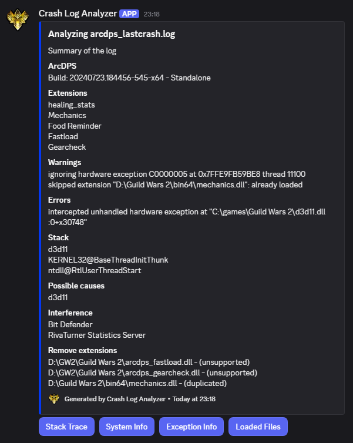

# Crash Log Analyzer

A Discord application to read .log and .txt files generated by ArcDPS after a crash.

## Build

- Follow the [Discord Application guide](https://discord.com/developers/docs/quick-start/getting-started) to create a new application.
- Generate a token under Bot->Token in your application settings.
- Create a .env file with the field ```DISCORD_TOKEN=``` and paste the token generated.
- Build and run the application.

## Example

